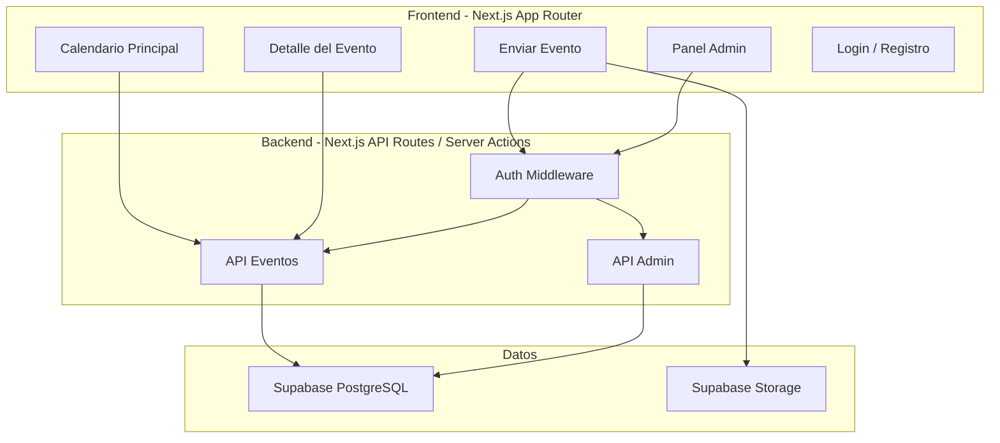
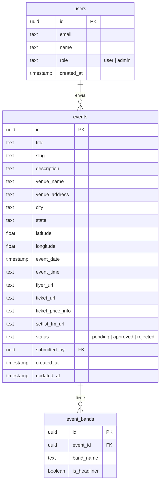

# Plan: Sitio Web de Eventos de Metal en México

## Stack Tecnológico

- **Framework**: Next.js 14+ (App Router) con TypeScript
- **Base de datos**: PostgreSQL vía Supabase (incluye auth, storage y DB en tier gratuito)
- **ORM**: Prisma
- **Autenticación**: Supabase Auth (email/password + OAuth con Google/Facebook)
- **UI**: Tailwind CSS + shadcn/ui (componentes accesibles y modernos) + CSS Modules (estilos específicos por componente)
- **Calendario**: `@fullcalendar/react` para la vista de calendario interactivo
- **Imágenes**: Supabase Storage (flyers de eventos, fotos de reseñas)
- **Deploy**: Vercel (conectado al repo de Git)
- **Validación**: Zod para validación de formularios y API

## Arquitectura General



## Modelo de Datos (MVP)



## Fases del Proyecto

### Fase 1 - MVP (alcance actual)

**1. Setup del proyecto**

- Inicializar Next.js con TypeScript, Tailwind, shadcn/ui
- Configurar Supabase (proyecto, tablas, storage bucket)
- Configurar Prisma con el schema de la DB
- Estructura de carpetas App Router

**2. Autenticación**

- Registro e inicio de sesión con Supabase Auth
- Middleware para proteger rutas de admin y envío de eventos
- Roles: `user` (enviar eventos) y `admin` (aprobar/rechazar/editar)

**3. Página principal - Calendario**

- FullCalendar con vista mensual como landing page
- Eventos mostrados como puntos/badges en cada día
- Click en un día muestra lista de eventos de ese día
- Filtros por estado (SLP por defecto, todo México disponible) y ciudad
- Diseño oscuro/metal con acentos rojos o naranjas (estética metal)

**4. Página de detalle del evento**

- Ruta dinámica: `/eventos/[slug]`
- Flyer del evento, bandas, fecha/hora, venue con dirección
- Enlace a compra de boletos (URL externa)
- Info de precio de entrada
- Enlace a setlist.fm (si existe)
- Botón de compartir (redes sociales)
- Meta tags OpenGraph para preview al compartir

**5. Envío de eventos (usuarios registrados)**

- Formulario completo: título, fecha, venue, ciudad/estado, bandas, flyer, URL de boletos, precio
- Upload de imagen del flyer
- Estado inicial: `pending` (requiere aprobación de admin)
- Lista de estados de México con ciudades principales

**6. Panel de administración**

- `/admin` - Dashboard con eventos pendientes
- Aprobar/rechazar eventos con comentario opcional
- Editar cualquier evento
- Listado de todos los eventos con filtros

**7. SEO y rendimiento**

- Server-side rendering para páginas de eventos (indexación)
- Sitemap dinámico
- Meta tags optimizados para compartir en redes
- Structured data (JSON-LD) para eventos

### Fase 2 (posterior al MVP)

- Reseñas de usuarios con fotos
- Blog editorial
- Integración de API de setlist.fm para mostrar setlists inline
- Sistema de notificaciones (nuevos eventos en tu ciudad)

### Fase 3 (posterior)

- Venta de boletos integrada (Stripe + sistema propio, o integración con Boletia/Ticketmaster)
- Mapa interactivo de venues
- App móvil o PWA

## Estructura de Carpetas Propuesta

Cada ruta tiene sus propios archivos de componente y layout. El `layout.tsx` raíz define el layout base (fuentes, navbar, footer, providers) que heredan todas las páginas. Las rutas que necesiten un layout adicional (ej: admin) definen el suyo propio, que se anida dentro del root layout.

Los estilos específicos de cada componente usan CSS Modules (`.module.css`) colocados junto al componente que los usa. Tailwind se usa para utilidades rápidas y shadcn/ui para componentes base.

```
src/
  app/
    layout.tsx                          # Root layout (navbar, footer, providers, fuentes)
    layout.module.css                   # Estilos del root layout
    page.tsx                            # Calendario principal
    page.module.css                     # Estilos del calendario
    globals.css                         # Variables CSS globales + Tailwind directives
    eventos/
      [slug]/
        page.tsx                        # Detalle del evento
        page.module.css
        components/
          EventHeader.tsx               # Componentes locales de esta ruta
          EventHeader.module.css
          BandList.tsx
          BandList.module.css
          TicketInfo.tsx
    enviar-evento/
      page.tsx                          # Formulario envío
      page.module.css
      components/
        EventForm.tsx
        EventForm.module.css
        BandInput.tsx
        FlyerUpload.tsx
    admin/
      layout.tsx                        # Layout admin (sidebar, protección de ruta)
      layout.module.css
      page.tsx                          # Dashboard admin
      page.module.css
      eventos/
        page.tsx                        # Gestión de eventos
        page.module.css
        components/
          EventTable.tsx
          EventApprovalCard.tsx
    auth/
      layout.tsx                        # Layout auth (centrado, sin navbar completa)
      login/
        page.tsx
        page.module.css
      registro/
        page.tsx
        page.module.css
    api/
      events/route.ts                   # CRUD eventos
  components/
    ui/                                 # shadcn/ui components (compartidos)
    shared/                             # Componentes reutilizables entre rutas
      Navbar/
        Navbar.tsx
        Navbar.module.css
      Footer/
        Footer.tsx
        Footer.module.css
      EventCard/
        EventCard.tsx
        EventCard.module.css
  lib/
    supabase/
      server.ts                         # Cliente Supabase servidor
      client.ts                         # Cliente Supabase navegador
    prisma.ts                           # Cliente Prisma
    utils.ts
  types/
prisma/
  schema.prisma
public/
```

## Propuesta sobre Setlist.fm

- **MVP**: Campo opcional `setlist_fm_url` en el evento. Si existe, se muestra un botón/enlace "Ver setlist en setlist.fm".
- **Fase 2**: Integrar la API de setlist.fm (gratuita para uso no comercial) para buscar y mostrar el setlist directamente en la página del evento, usando el nombre de la banda + fecha como parámetros de búsqueda.

## Convenciones de Estilos

- **Tailwind CSS**: utilidades rápidas para spacing, flexbox, grid, colores base, responsive
- **CSS Modules** (`.module.css`): estilos específicos y complejos de cada componente (animaciones, layouts elaborados, pseudo-elementos). Cada archivo `.module.css` vive junto a su componente
- **shadcn/ui**: componentes base (Button, Dialog, Input, Select, etc.) que se personalizan con Tailwind y CSS Modules según se necesite
- **`globals.css`**: variables CSS custom (colores del tema, fuentes) + directivas de Tailwind

## Convenciones de Layouts

- **Root layout** (`src/app/layout.tsx`): define la estructura base de toda la app (html, body, fuentes, Navbar, Footer, providers de contexto). Todas las páginas lo heredan automáticamente
- **Layouts de ruta**: solo se crean cuando una sección necesita estructura diferente (ej: `/admin` con sidebar, `/auth` con layout centrado sin navbar)
- Los layouts se anidan: el layout de `/admin` se renderiza DENTRO del root layout

## Notas Importantes

- La estética será oscura (tema metal) con tipografía bold, contrastes fuertes, y paleta de colores oscuros con acentos en rojo/naranja
- SLP será el estado por defecto en filtros, pero todos los 32 estados de México estarán disponibles
- Las imágenes de flyers se optimizarán automáticamente con Next.js Image
- El calendario será responsive y funcional en móvil

## Tareas del MVP

- [ ] Inicializar Next.js + TypeScript + Tailwind + shadcn/ui + Prisma + Supabase
- [ ] Crear schema de Prisma y migraciones (users, events, event_bands)
- [ ] Implementar autenticación con Supabase Auth (registro, login, middleware, roles)
- [ ] Página principal con FullCalendar, filtros por estado/ciudad, vista de eventos por día
- [ ] Página de detalle del evento con slug dinámico, SEO, OpenGraph, enlace boletos y setlist.fm
- [ ] Formulario de envío de eventos con upload de flyer y validación
- [ ] Panel admin: dashboard, aprobar/rechazar eventos, editar eventos
- [ ] Sitemap dinámico, structured data JSON-LD, meta tags, optimización de imágenes
- [ ] Tema visual oscuro/metal con Tailwind, responsive design, tipografía
